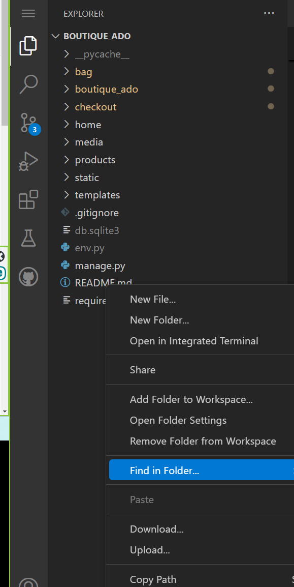
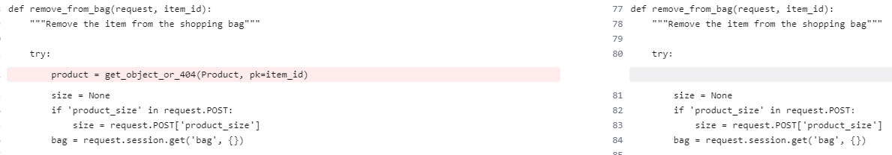
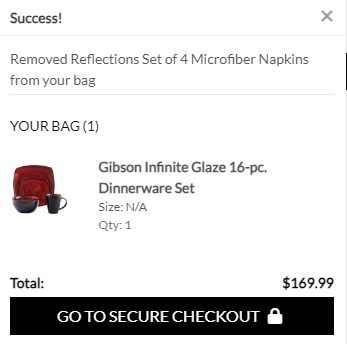

## Bug fix - "Remove"

Even though working on ReadMe wasn't a requirement for this Walk-Through project,
Developer was excited to share how she fixed this particular bug.
And she took Kera Cudmore, Code Institute Alumna's recommendation
to add this bug fix to Walk-Through ReadMe anyway,
for future potential employers.

- Developer noticed "Remove" option did not remove an item from the shopping bag:

- Inspection of the webpage didn't add clarity of where issue was based. Developer thought issue was with her template: base.html

- Developer opted to find the word "Remove" within the project, hoping some clarity this way:

- This step helped developer to see that issue might be with bag_views.py instead of base.html:

[Bag_views](media/readme-img/bag_views_find.png)

- Developer chose to use [Diffchecker](https://www.diffchecker.com/text-compare/) to compare her bag_views.py file vs
  Source Code:
  [Boutique Ado](https://github.com/Code-Institute-Solutions/boutique_ado_v1/blob/4f4a39d898c2c347e0d0a0201e4c0d2d6ef1c500/bag/views.py)

- Thanks to Diffchecker, Developer noticed she was missing a line in bag_views.py:

- Developer added the missing line of code, and "Remove" option worked ok:

## Guidelines from CI, from the Default ReadMe, keep for now:

By Default, Gitpod gives you superuser security privileges. Therefore, you do not need to use the `sudo` (superuser do) command in the bash terminal in any of the lessons.

To log into the Heroku toolbelt CLI:

1. Log in to your Heroku account and go to *Account Settings* in the menu under your avatar.
2. Scroll down to the *API Key* and click *Reveal*
3. Copy the key
4. In Gitpod, from the terminal, run `heroku_config`
5. Paste in your API key when asked

You can now use the `heroku` CLI program - try running `heroku apps` to confirm it works. This API key is unique and private to you, so do not share it. If you accidentally make it public, you can create a new one with _Regenerate API Key_.

### Connecting your Mongo database

- **Connect to Mongo CLI on a IDE**
- navigate to your MongoDB Clusters Sandbox
- click **"Connect"** button
- select **"Connect with the MongoDB shell"**
- select **"I have the mongo shell installed"**
- choose **mongosh (2.0 or later)** for : **"Select your mongo shell version"**
- choose option: **"Run your connection string in your command line"**
- in the terminal, paste the copied code `mongo "mongodb+srv://<CLUSTER-NAME>.mongodb.net/<DBname>" --apiVersion 1 --username <USERNAME>`
  - replace all `<angle-bracket>` keys with your own data
- enter password _(will not echo **\*\*\*\*** on screen)_

------

Yes! We'd strongly encourage you to look at the source code of the `uptime.sh` file so that you know what it's doing. As future software developers, it will be great practice to see how these shell scripts work.

---

Happy coding!
